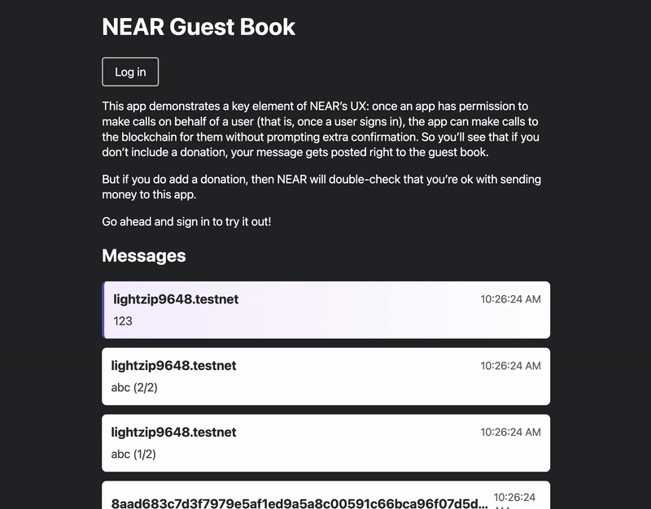

# NEAR Wallet Selector

NEAR Wallet Selector makes it easy for users to interact with your dApp by providing an abstraction over various wallets within the NEAR ecosystem:

- [NEAR Wallet](https://www.npmjs.com/package/@near-wallet-selector/near-wallet) - Browser wallet.
- [My NEAR Wallet](https://www.npmjs.com/package/@near-wallet-selector/my-near-wallet) - Browser wallet.
- [Sender](https://www.npmjs.com/package/@near-wallet-selector/sender) - Injected wallet.
- [Math Wallet](https://www.npmjs.com/package/@near-wallet-selector/math-wallet) - Injected wallet.
- [Nightly](https://www.npmjs.com/package/@near-wallet-selector/nightly) - Injected wallet.
- [Meteor Wallet](https://www.npmjs.com/package/@near-wallet-selector/meteor-wallet) - Injected wallet.
- [Metamask Snap](https://www.npmjs.com/package/@near-wallet-selector/near-snap) - Injected wallet.
- [Narwallets](https://www.npmjs.com/package/@near-wallet-selector/narwallets) - Injected wallet.
- [WELLDONE Wallet](https://www.npmjs.com/package/@near-wallet-selector/welldone-wallet) - Injected wallet.
- [Coin98 Wallet](https://www.npmjs.com/package/@near-wallet-selector/coin98-wallet) - Injected wallet.
- [Neth](https://www.npmjs.com/package/@near-wallet-selector/neth) - Injected wallet.
- [XDEFI Wallet](https://www.npmjs.com/package/@near-wallet-selector/xdefi) - Injected wallet.
- [Ledger](https://www.npmjs.com/package/@near-wallet-selector/ledger) - Hardware wallet.
- [WalletConnect](https://www.npmjs.com/package/@near-wallet-selector/wallet-connect) - Bridge wallet.
- [Nightly Connect](https://www.npmjs.com/package/@near-wallet-selector/nightly-connect) - Bridge wallet.
- [Here Wallet](https://www.npmjs.com/package/@near-wallet-selector/here-wallet) - Mobile wallet.
- [NearFi Wallet](https://www.npmjs.com/package/@near-wallet-selector/nearfi) - Mobile wallet.
- [Opto Wallet](https://www.npmjs.com/package/@near-wallet-selector/opto-wallet) - Mobile wallet & Browser wallet.
- [Finer Wallet](https://www.npmjs.com/package/@near-wallet-selector/finer-wallet) - Mobile wallet & Browser wallet.

## Preview

[React](https://reactjs.org/) / [Next.js](https://nextjs.org/) and [Angular](https://angular.io/) variations of the [Guest Book](https://github.com/near-examples/guest-book/) dApp can be found in the [`examples`](/examples) directory. You can use these to gain a concrete understanding of how to integrate NEAR Wallet Selector into your own dApp.



## Installation and Usage

The easiest way to use NEAR Wallet Selector is to install the [`core`](https://www.npmjs.com/package/@near-wallet-selector/core) package from the NPM registry, some packages may require `near-api-js` v0.44.2 or above check them at [`packages`](./packages)

```bash
# Using Yarn
yarn add near-api-js

# Using NPM.
npm install near-api-js
```

```bash
# Using Yarn
yarn add @near-wallet-selector/core

# Using NPM.
npm install @near-wallet-selector/core
```

Next, you'll need to install the wallets you want to support:

```bash
# Using Yarn
yarn add \
  @near-wallet-selector/near-wallet \
  @near-wallet-selector/my-near-wallet \
  @near-wallet-selector/sender \
  @near-wallet-selector/nearfi \
  @near-wallet-selector/here-wallet \
  @near-wallet-selector/math-wallet \
  @near-wallet-selector/nightly \
  @near-wallet-selector/meteor-wallet \
  @near-wallet-selector/narwallets \
  @near-wallet-selector/welldone-wallet \
  @near-wallet-selector/near-snap \
  @near-wallet-selector/ledger \
  @near-wallet-selector/wallet-connect \
  @near-wallet-selector/nightly-connect \
  @near-wallet-selector/default-wallets \
  @near-wallet-selector/coin98-wallet \
  @near-wallet-selector/opto-wallet \
  @near-wallet-selector/finer-wallet \
  @near-wallet-selector/neth \
  @near-wallet-selector/xdefi

# Using NPM.
npm install \
  @near-wallet-selector/near-wallet \
  @near-wallet-selector/my-near-wallet \
  @near-wallet-selector/sender \
  @near-wallet-selector/nearfi \
  @near-wallet-selector/here-wallet \
  @near-wallet-selector/math-wallet \
  @near-wallet-selector/nightly \
  @near-wallet-selector/meteor-wallet \
  @near-wallet-selector/narwallets \
  @near-wallet-selector/welldone-wallet \
  @near-wallet-selector/near-snap \
  @near-wallet-selector/ledger \
  @near-wallet-selector/wallet-connect \
  @near-wallet-selector/nightly-connect \
  @near-wallet-selector/default-wallets \
  @near-wallet-selector/coin98-wallet \
  @near-wallet-selector/opto-wallet \
  @near-wallet-selector/finer-wallet \
  @near-wallet-selector/neth \
  @near-wallet-selector/xdefi
```

Optionally, you can install our [`modal-ui`](https://www.npmjs.com/package/@near-wallet-selector/modal-ui) or [`modal-ui-js`](https://www.npmjs.com/package/@near-wallet-selector/modal-ui-js) package for a pre-built interface that wraps the `core` API and presents the supported wallets:

```bash
# Using Yarn
yarn add @near-wallet-selector/modal-ui

# Using NPM.
npm install @near-wallet-selector/modal-ui
```

Then in your dApp:

```ts
import { setupWalletSelector } from "@near-wallet-selector/core";
import { setupModal } from "@near-wallet-selector/modal-ui";
import { setupNearWallet } from "@near-wallet-selector/near-wallet";
import { setupMyNearWallet } from "@near-wallet-selector/my-near-wallet";
import { setupSender } from "@near-wallet-selector/sender";
import { setupHereWallet } from "@near-wallet-selector/here-wallet";
import { setupMathWallet } from "@near-wallet-selector/math-wallet";
import { setupNightly } from "@near-wallet-selector/nightly";
import { setupMeteorWallet } from "@near-wallet-selector/meteor-wallet";
import { setupNarwallets } from "@near-wallet-selector/narwallets";
import { setupWelldoneWallet } from "@near-wallet-selector/welldone-wallet";
import { setupNearSnap } from "@near-wallet-selector/near-snap";
import { setupLedger } from "@near-wallet-selector/ledger";
import { setupWalletConnect } from "@near-wallet-selector/wallet-connect";
import { setupNightlyConnect } from "@near-wallet-selector/nightly-connect";
import { setupDefaultWallets } from "@near-wallet-selector/default-wallets";
import { setupNearFi } from "@near-wallet-selector/nearfi";
import { setupCoin98Wallet } from "@near-wallet-selector/coin98-wallet";
import { setupOptoWallet } from "@near-wallet-selector/opto-wallet";
import { setupFinerWallet } from "@near-wallet-selector/finer-wallet";
import { setupNeth } from "@near-wallet-selector/neth";
import { setupXDEFI } from "@near-wallet-selector/xdefi";

const selector = await setupWalletSelector({
  network: "testnet",
  modules: [
    ...(await setupDefaultWallets()),
    setupNearWallet(),
    setupMyNearWallet(),
    setupSender(),
    setupHereWallet(),
    setupMathWallet(),
    setupNightly(),
    setupMeteorWallet(),
    setupNearSnap(),
    setupNarwallets(),
    setupWelldoneWallet(),
    setupLedger(),
    setupNearFi(),
    setupCoin98Wallet(),
    setupOptoWallet(),
    setupFinerWallet(),
    setupNeth(),
    setupXDEFI(),
    setupWalletConnect({
      projectId: "c4f79cc...",
      metadata: {
        name: "NEAR Wallet Selector",
        description: "Example dApp used by NEAR Wallet Selector",
        url: "https://github.com/near/wallet-selector",
        icons: ["https://avatars.githubusercontent.com/u/37784886"],
      },
    }),
    setupNightlyConnect({
      url: "wss://relay.nightly.app/app",
      appMetadata: {
        additionalInfo: "",
        application: "NEAR Wallet Selector",
        description: "Example dApp used by NEAR Wallet Selector",
        icon: "https://near.org/wp-content/uploads/2020/09/cropped-favicon-192x192.png",
      },
    }),
  ],
});

const modal = setupModal(selector, {
  contractId: "guest-book.testnet"
});
```

## Contributing

Contributors may find the [`examples`](./examples) directory useful as it provides a quick and consistent way to manually test new changes and/or bug fixes.

More details around contributing to this project can be found [here](./CONTRIBUTING.md).

## Editor Setup

This project uses [ESLint](https://eslint.org/) (with [Prettier](https://prettier.io/)) to enforce a consistent coding style. It's important that you configure your editor correctly to avoid issues when you're ready to open a Pull Request.

Although this project uses Prettier, it's simply an "internal" dependency to our ESLint configuration. This is because we want Prettier to handle code styling while avoiding conflicts with ESLint which specifically focuses on potentially problematic code. As a result, **it's important that you switch off Prettier in your editor and ensure only ESLint is enabled**.

## License

This repository is distributed under the terms of both the MIT license and the Apache License (Version 2.0). See [LICENSE-MIT](LICENSE-MIT) and [LICENSE-APACHE](LICENSE-APACHE) for details.
