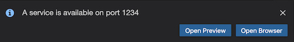

Guest Book - Gitpod version
===========================

Sign in with [NEAR] and add a message to the guest book! A starter app built with an [AssemblyScript] backend and a [React] frontend.

This README is specific to Gitpod and this example. For local development, please see [README.md](README.md).

Exploring The Code
==================

1. The backend code lives in the `/assembly` folder. This code gets deployed to
   the NEAR blockchain when you run `yarn deploy:contract`. This sort of
   code-that-runs-on-a-blockchain is called a "smart contract" – [learn more
   about NEAR smart contracts][smart contract docs].
2. The frontend code lives in the `/src` folder.
   [/src/index.html](/src/index.html) is a great place to start exploring. Note
   that it loads in `/src/index.js`, where you can learn how the frontend
   connects to the NEAR blockchain.
3. Tests: there are different kinds of tests for the frontend and backend. The
   backend code gets tested with the [asp] command for running the backend
   AssemblyScript tests, and [jest] for running frontend tests. You can run
   both of these at once with `yarn test`.

Both contract and client-side code will auto-reload as you change source files.

Using
======

Gitpod has taken care of installing all the necessary tools and dependencies. At the bottom of Gitpod is a terminal which will display a link to follow:

    Server running at http://localhost:1234

A small dialog appears showing options similar to this:

The "Open Preview" option will open the site in a tab within the IDE. Note that Gitpod may need a little time to spin up the website. It's possible this step might require reloading after a brief pause.

The "Open Browser" option will open a new tab in your browser. Either option will work and is up to your preference.

Once you've opened the web app in your browser, log in and experiment with the simple "guest book" smart contract.

The "Save" button sends the text input to the blockchain, storing it as a string. The web app will reload with the new guest book messages automatically.

The "Save & Donate" button demonstrates attaching NEAR and a gas price when calling the smart contract's method `addMessage`. When the web app refreshes with "paid" messages, the user interface highlights them.

Data collection
===============
By using Gitpod in this project, you agree to opt-in to basic, anonymous analytics. No personal information is transmitted. Instead, these usage statistics aid in discovering potential bugs and user flow information.

  [smart contract docs]: https://docs.near.org/docs/develop/contracts/overview
  [asp]: https://www.npmjs.com/package/@as-pect/cli
  [jest]: https://jestjs.io/
  [NEAR]: https://near.org/
  [AssemblyScript]: https://www.assemblyscript.org/introduction.html
  [React]: https://reactjs.org
