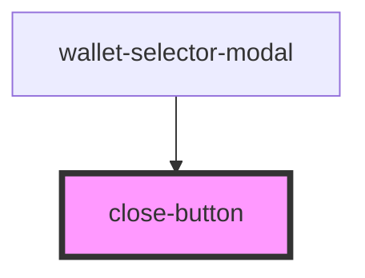

# close-button

<!-- Auto Generated Below -->

## Events

| Event                 | Description | Type                      |
| --------------------- | ----------- | ------------------------- |
| `nearModalCloseEvent` |             | `CustomEvent<MouseEvent>` |

## Dependencies

### Used by

 - [wallet-selector-modal](..)

### Graph

----------------------------------------------

*Built with [StencilJS](https://stenciljs.com/)*
