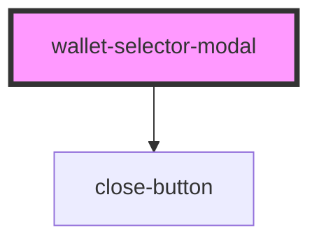

# wallet-selector-modal

<!-- Auto Generated Below -->

## Properties

| Property | Attribute | Description                       | Type                          | Default  |
| -------- | --------- | --------------------------------- | ----------------------------- | -------- |
| `theme`  | `theme`   | The prefered theme for the modal. | `"auto" \| "dark" \| "light"` | `'auto'` |

## Methods

### `hide() => Promise<void>`

Method to hide the modal

#### Returns

Type: `Promise<void>`

### `show() => Promise<void>`

Method to show the modal.

#### Returns

Type: `Promise<void>`

## Dependencies

### Depends on

- [close-button](close-button)

### Graph

----------------------------------------------

*Built with [StencilJS](https://stenciljs.com/)*
