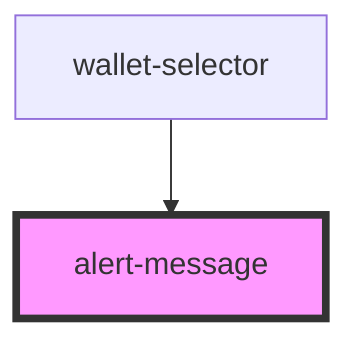

# alert-message

<!-- Auto Generated Below -->

## Properties

| Property               | Attribute | Description | Type     | Default     |
| ---------------------- | --------- | ----------- | -------- | ----------- |
| `message` _(required)_ | `message` |             | `string` | `undefined` |

## Events

| Event           | Description | Type                      |
| --------------- | ----------- | ------------------------- |
| `nearBackEvent` |             | `CustomEvent<MouseEvent>` |

## Dependencies

### Used by

 - [wallet-selector](..)

### Graph

----------------------------------------------

*Built with [StencilJS](https://stenciljs.com/)*
