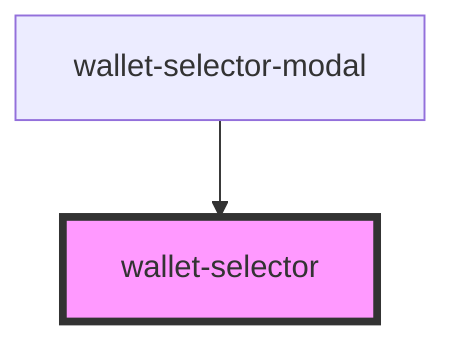

# wallet-selector

<!-- Auto Generated Below -->

## Methods

### `setSelector(selector: WalletSelector) => Promise<void>`

#### Returns

Type: `Promise<void>`

## Dependencies

### Used by

 - [wallet-selector-modal](../wallet-selector-modal)

### Graph

----------------------------------------------

*Built with [StencilJS](https://stenciljs.com/)*
