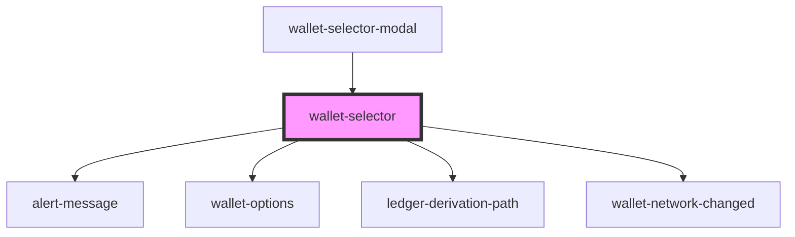

# wallet-selector

<!-- Auto Generated Below -->

## Methods

### `setSelector(selector: unknown) => Promise<void>`

#### Returns

Type: `Promise<void>`

## Dependencies

### Used by

 - [wallet-selector-modal](../wallet-selector-modal)

### Depends on

- [alert-message](alert-message)
- [wallet-options](wallet-options)
- [ledger-derivation-path](ledger-derivation-path)
- [wallet-network-changed](wallet-network-changed)

### Graph

----------------------------------------------

*Built with [StencilJS](https://stenciljs.com/)*
