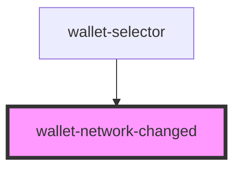

# wallet-network-changed

<!-- Auto Generated Below -->

## Properties

| Property   | Attribute  | Description | Type  | Default     |
| ---------- | ---------- | ----------- | ----- | ----------- |
| `selector` | `selector` |             | `any` | `undefined` |

## Events

| Event                      | Description | Type                  |
| -------------------------- | ----------- | --------------------- |
| `nearSwitchWallet`         |             | `CustomEvent<string>` |
| `nearWalletNetworkDismiss` |             | `CustomEvent<string>` |

## Dependencies

### Used by

 - [wallet-selector](..)

### Graph

----------------------------------------------

*Built with [StencilJS](https://stenciljs.com/)*
