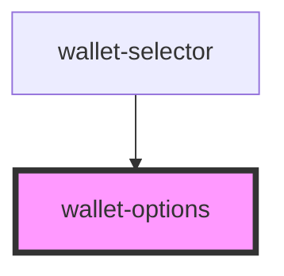

# wallet-options

<!-- Auto Generated Below -->

## Properties

| Property   | Attribute  | Description | Type           | Default     |
| ---------- | ---------- | ----------- | -------------- | ----------- |
| `options`  | --         |             | `ModalOptions` | `undefined` |
| `selector` | `selector` |             | `any`          | `undefined` |

## Events

| Event                       | Description | Type                      |
| --------------------------- | ----------- | ------------------------- |
| `nearConnected`             |             | `CustomEvent<void>`       |
| `nearConnectHardwareWallet` |             | `CustomEvent<MouseEvent>` |
| `nearErrorWalletOptions`    |             | `CustomEvent<string>`     |

## Dependencies

### Used by

 - [wallet-selector](..)

### Graph

----------------------------------------------

*Built with [StencilJS](https://stenciljs.com/)*
